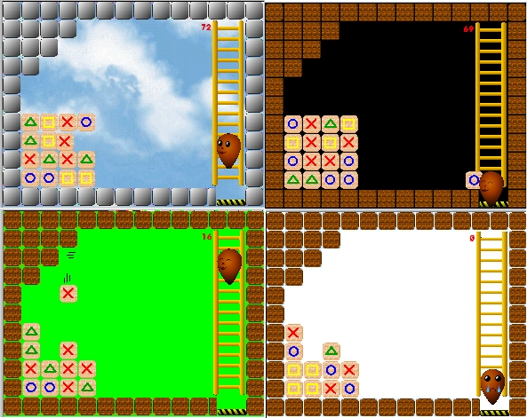



## Fuzzy game\! Check it out\!

### Description

A cool game. It is an immitation of a game I had in my nintendo. you have to throw a block with a symbol to the pile of blocks and hit one similar with it. Time is running out.

Exelent graphics, good sound, level editor.

A must see.

Note: Scrreen shot is the 1/2 of the actual size

(i.e 640x480) pixcels.

No direct X

A little APIs (bitblt,Sndplaysound)
 
### More Info
 

             |
---                |---
**Submitted On**   |2002-05-11 22:49:42
**By**             |[Lefteris Eleftheriades](https://github.com/Planet-Source-Code/PSCIndex/blob/master/ByAuthor/lefteris-eleftheriades.md)
**Level**          |Intermediate
**User Rating**    |4.9 (39 globes from 8 users)
**Compatibility**  |VB 5\.0, VB 6\.0
**Category**       |[Games](https://github.com/Planet-Source-Code/PSCIndex/blob/master/ByCategory/games__1-38.md)
**World**          |[Visual Basic](https://github.com/Planet-Source-Code/PSCIndex/blob/master/ByWorld/visual-basic.md)
**Archive File**   |[Fuzzy\_game820255112002\.zip](https://github.com/Planet-Source-Code/lefteris-eleftheriades-fuzzy-game-check-it-out__1-34699/archive/master.zip)

